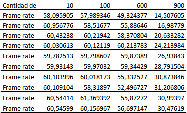
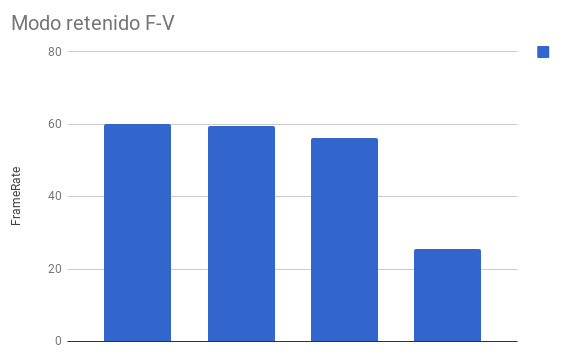

# Taller de mallas poligonales

## Propósito

Estudiar la relación entre las [aplicaciones de mallas poligonales](https://github.com/VisualComputing/representation), su modo de [representación](https://en.wikipedia.org/wiki/Polygon_mesh) (i.e., estructuras de datos empleadas para representar la malla en RAM) y su modo de [renderizado](https://processing.org/tutorials/pshape/) (i.e., modo de transferencia de la geometría a la GPU).

## Tareas

Hacer un benchmark (midiendo los *fps* promedio) de varias representaciones de mallas poligonales para los _boids_ del ejemplo del [FlockOfBoids](https://github.com/VisualComputing/framesjs/tree/processing/examples/Advanced/FlockOfBoids) (requiere la librería [frames](https://github.com/VisualComputing/framesjs/releases), versión ≥ 0.1.0), tanto en modo inmediato como retenido de rendering.

1. Represente la malla del [boid](https://github.com/VisualComputing/framesjs/blob/processing/examples/Advanced/FlockOfBoids/Boid.pde) al menos de ~tres~ dos formas distintas.
2. Renderice el _flock_ en modo inmediato y retenido, implementando la función ```render()``` del [boid](https://github.com/VisualComputing/framesjs/blob/processing/examples/Advanced/FlockOfBoids/Boid.pde).
3. Haga un benchmark que muestre una comparativa de los resultados obtenidos.

### Opcionales

1. Realice la comparativa para diferentes configuraciones de hardware.
2. Realice la comparativa de *fps* sobre una trayectoria de animación para el ojo empleando un [interpolator](https://github.com/VisualComputing/framesjs/tree/processing/examples/Basics/B8_Interpolation2) (en vez de tomar su promedio).
3. Anime la malla, como se hace en el ejemplo de [InteractiveFish](https://github.com/VisualComputing/framesjs/tree/processing/examples/ik/InteractiveFish).
4. Haga [view-frustum-culling](https://github.com/VisualComputing/framesjs/tree/processing/examples/Demos/ViewFrustumCulling) de los _boids_ cuando el ojo se encuentre en tercera persona.

### Profundizaciones

1. Introducir el rol depredador.
2. Cómo se afecta el comportamiento al tener en cuenta el [campo visual](https://es.wikipedia.org/wiki/Campo_visual) (individual)?
3. Implementar el algoritmo del ```flock()``` en [OpenCL](https://en.wikipedia.org/wiki/OpenCL). Ver [acá](https://www.youtube.com/watch?v=4NU37rPOAsk) un ejemplo de *Processing* en el que se que emplea [JOCL](http://www.jocl.org/).

### References

1. [Reynolds, C. W. Flocks, Herds and Schools: A Distributed Behavioral Model. 87](http://www.cs.toronto.edu/~dt/siggraph97-course/cwr87/).
2. Check also this [nice presentation](https://pdfs.semanticscholar.org/73b1/5c60672971c44ef6304a39af19dc963cd0af.pdf) about the paper:
3. There are many online sources, google for more...

## Integrantes

Máximo 3.

Complete la tabla:

| Integrante | github nick |
|------------|-------------|
|Degly Sebastián Pava Pava|DglyP|
|Carlos Arturo López|caralopezromUN|

## Entrega

* Modo de entrega: Haga [fork](https://help.github.com/articles/fork-a-repo/) de la plantilla e informe la url del repo en la hoja *urls* de la plantilla compartida (una sola vez por grupo). Plazo: 15/4/18 a las 24h.
* Exposición oral en el taller de la siguiente semana (6 minutos: 4 para presentar y 2 para preguntas). Estructura sugerida:
  1. Representaciones estudiadas.
  2. Demo.
  3. Resultados (benchmark).
  4. Conclusiones.

## Resultados

### Introducción
   
   Por medio de la utilización de Processing y Java logramos representar dos métodos para renderizar un elemento. Estos dos métodos son el modo retenido y el modo inmediato.
    
   El modo retenido nos permite la interpretación de un objeto una sola vez, en el momento de su creación inicial. Esto nos permite hacer uso del mismo sin necesidad de interpretarlo de nuevo, lo cual implicaría más utilización de procesamiento y memoria. En la escena de Processing que se esté manejando nos da la posibilidad de utilizar la memoria RAM para mejorar el rendimiento y el tiempo de renderizado.
    
   El modo inmediato sin embargo, no cuenta con la posibilidad de guardar información relacionada al elemento renderizado en la memoria RAM, por lo que no es posible utilizarlo sin interpretarlo en cada uno de sus usos. Este tipo de acercamiento es ampliamente utilizado cuando la capacidad de almacenamiento al momento del renderizado no es la mejor.
   
### Resultados

   El taller desarrollado se enfoca en el proceso de renderización de mallas poligonales con diferentes representaciones. El proyecto en el que se trabajó consiste en un numero variable de tetahedros que conforman juntos una manada que simula un agente con vida artificial.
   
   A partir de esto, tomamos dos representaciones diferentes y utilizamos las conocidas como Face-Vertex y Vertex-Vertex.
 
<p align="center">
  
  
  
  
  
  
  
  
  
  
  
  

</p>


